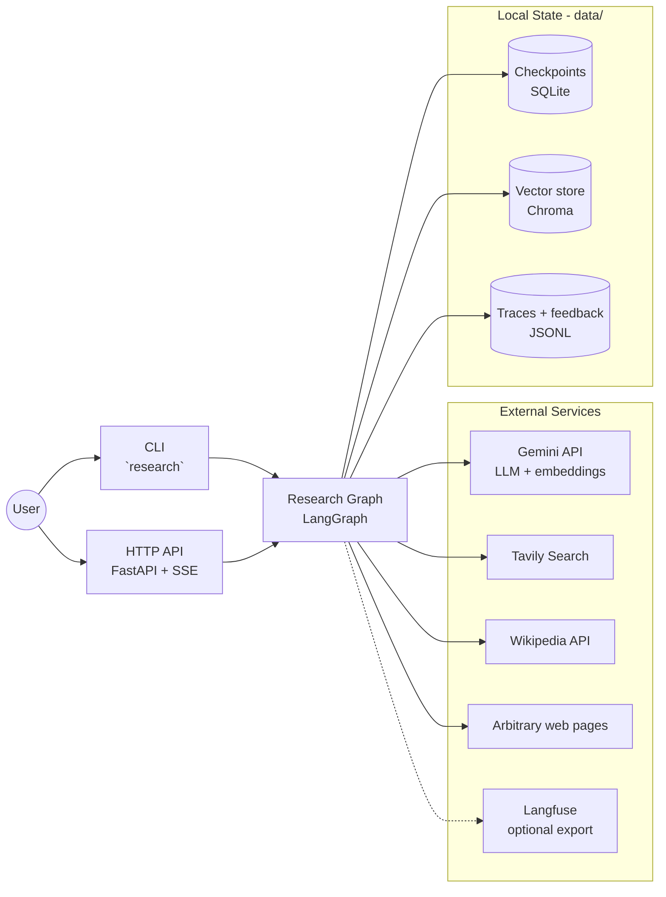
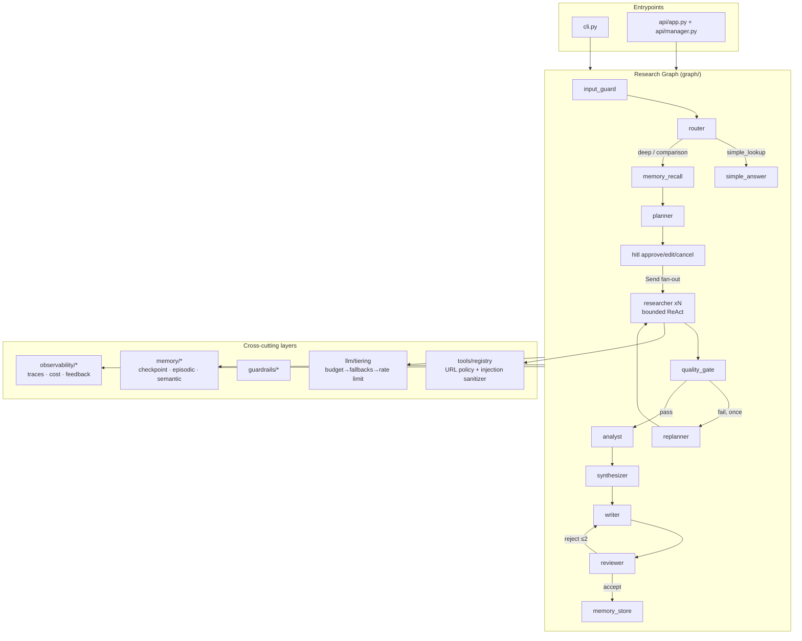

# High-Level Design (HLD) — deep-research

> **System:** deep-research — a production-grade deep research agent
> **Version:** 1.0 · **Status:** implemented (10 sprints, CI green)
> Companion documents: [LLD.md](LLD.md) (component internals) · [adr/](adr/) (decision records) · [patterns.md](patterns.md) (pattern→code→test map)

---

## 1. Purpose & Scope

Given a research topic, produce a **cited, conflict-checked, quality-reviewed research
report** from live web sources — with the safety, cost, durability, and observability
properties of a production service. This document describes the system at the
architecture level: components, data flow, technology choices, and cross-cutting
concerns. Internals of each component are in the [LLD](LLD.md).

## 2. Goals & Non-Functional Requirements

| # | Requirement | Target | Mechanism (summary) |
|---|---|---|---|
| NFR-1 | Trustworthy output | Every claim cited; conflicts surfaced; gaps stated | Grounded prompts, analyst claim extraction, synthesizer conflict detection, reviewer rubric, eval gates |
| NFR-2 | Bounded execution | No unbounded loops or spend | Hard caps: ReAct iterations, writer revisions, replan-once, pre-call budget gate |
| NFR-3 | Durability | Crash/stop loses no paid work | Checkpoint after every graph step; resume by thread id |
| NFR-4 | Auditability | Any run fully inspectable after the fact | Trace per run (spans, tokens, cost); feedback tied to trace id |
| NFR-5 | Steerability | Human control before the expensive phase | Interrupt-based plan approval (approve/edit/cancel) |
| NFR-6 | Safety | Malicious/degenerate input & content contained | Layered guardrails (input gate, PII, injection, SSRF, URL policy) |
| NFR-7 | Cost efficiency | Trivial queries ≤10% of deep-run cost | LLM router short path (measured 7.6%), model tiering, no-LLM gate |
| NFR-8 | Testability | Quality verifiable offline and in CI | 132 offline unit tests; deterministic + LLM-judge eval suite |

**Out of scope (deliberate):** multi-tenant auth, horizontal scaling of the API
(single-instance design, scaling path documented in §8), supervisor multi-agent,
MCP tool servers.

## 3. System Context

Trust boundaries: everything returned by External Services is **untrusted input**
(sanitized at the tool registry); the user's topic is **untrusted input** (input
guard). Secrets exist only in environment config, never in code or state.

## 4. Component Architecture

Component responsibilities (one line each):

| Component | Responsibility |
|---|---|
| Entrypoints (CLI/API) | Sessioning, HITL interaction, presentation; no business logic |
| Research graph | All orchestration; nodes are pure functions over shared state |
| `llm/tiering` | The only way to reach a model: budget gate → fallback chain → rate-limited client |
| `tools/registry` | The only way to reach a tool: definitions + guard choke point |
| `guardrails/` | Input gate, PII, injection, URL/SSRF policy, budget, rate limit |
| `memory/` | Durable checkpoints; episodic/semantic long-term memory behind a vector-store interface |
| `observability/` | Trace recorder (spans/cost), feedback store, optional Langfuse export |

## 5. Primary Flows

**Deep research (happy path):** input guard → router (`deep_research`) → episodic
recall seeds planner → plan → **pause for human approval** → parallel bounded-ReAct
researchers → deterministic quality gate (fail ⇒ one revised-query replan) →
analyst (claims) → synthesizer (conflicts) → writer ↔ reviewer (≤2 revisions) →
memory write-back → report + trace.

**Short path:** router classifies `simple_lookup` ⇒ one search + one cheap cited
answer (~7% of deep cost). **Refusal path:** guard refuses malicious/degenerate
input with an explanation at zero LLM cost. Sequence diagrams: [LLD §5](LLD.md#5-sequence-diagrams).

## 6. Technology Stack (with ADR links)

| Layer | Choice | Why (short) |
|---|---|---|
| Orchestration | LangGraph StateGraph | Graph model ≅ pattern set; checkpoint + interrupt built in ([ADR-001](adr/001-langgraph-over-crewai.md)) |
| LLMs | Gemini flash-lite (cheap tier) / flash (strong tier), env-config fallback chains | Tiering + independent failure domains ([ADR-003](adr/003-model-tiering-and-fallbacks.md)) |
| Contracts | Pydantic v2 everywhere | Structured output at every LLM boundary; schema-as-guardrail |
| Vector store | Embedded Chroma behind a thin interface | Zero infra in dev; Qdrant = one-module swap ([ADR-004](adr/004-embedded-chroma-over-qdrant.md)) |
| Durability | SQLite checkpointer (Postgres-ready) | Resume + HITL from one mechanism |
| Serving | FastAPI + SSE | Standard; streaming progress |
| Tracing | Own callback recorder → JSONL; Langfuse opt-in | Vendor-neutral core ([ADR-005](adr/005-vendor-neutral-tracing.md)) |
| Quality gate | Pure Python scoring | No LLM for mechanical decisions ([ADR-002](adr/002-no-llm-quality-gate.md)) |
| Tooling | uv, ruff, mypy --strict, pytest, pre-commit, GitHub Actions | Reproducible, gated from commit 1 |

## 7. Cross-Cutting Concerns

**Security (defense in depth):**

| Layer | Threat | Control |
|---|---|---|
| Input gate | Prompt-injection topics, degenerate input | Refuse with explanation, $0 |
| Input gate | PII to third parties | Scrub-and-continue, typed notes |
| Tool registry | Indirect injection in web content | Line-level sanitizer at one choke point |
| Tool registry + scraper | Malicious URLs, SSRF | URL policy (schemes/ports/credentials/blocklist) + private-IP class block |
| Secrets | Leakage | Env-only, SecretStr, gitignored .env, masked CI secrets |

**Reliability:** per-model retries (transient) → cross-family fallbacks (persistent)
→ per-domain circuit breaker (dead sites) → checkpoint resume (process death) →
best-effort memory/tracing (auxiliary systems can never fail the run).

**Cost:** router short path · cheap/strong tiering · seeded ReAct step 0 ·
no-LLM gate · shared rate limiter · pre-call budget cap (overshoot ≤ 1 call) ·
per-run cost accounting in traces.

**Observability:** `trace_id == thread_id == feedback key` — one id joins
checkpoint, trace, and human verdict. Quality is gated by a two-layer eval suite
(deterministic citation resolution, then LLM-as-judge) run in CI.

## 8. Deployment View & Scaling Path

Current: single process (CLI or one API instance via Docker Compose); all state
under `data/`. Documented scaling path when needed: SQLite→Postgres checkpointer
(config), Chroma→Qdrant (one module), in-process sessions→external store or sticky
routing (graph state is already externalized — only the ephemeral SSE event feed
is in-process), JSONL traces→Langfuse/OTel backend (config flip).

## 9. Risks & Known Limitations

| Risk | Mitigation / status |
|---|---|
| Provider quota exhaustion (free tier) | Cross-family fallbacks, low shared RPM, documented; paid key removes |
| LangGraph API churn | Locked deps; integration concentrated in builder + tiering |
| Injection heuristics are heuristics | Layered with prompt rules + registry choke point; not claimed as proof |
| Single-instance API sessions | Scaling path in §8; acceptable for current scope |
| Price table approximate | Used for guarding, not billing; documented |
