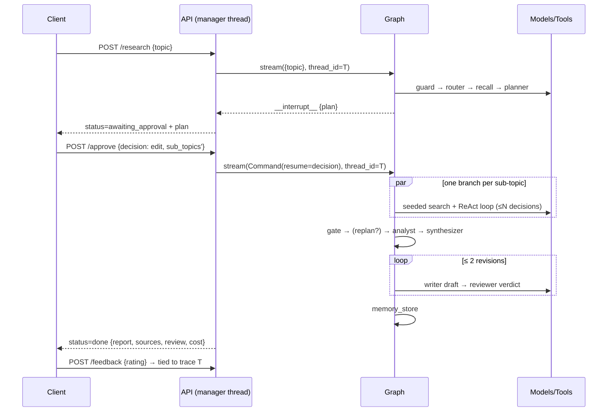
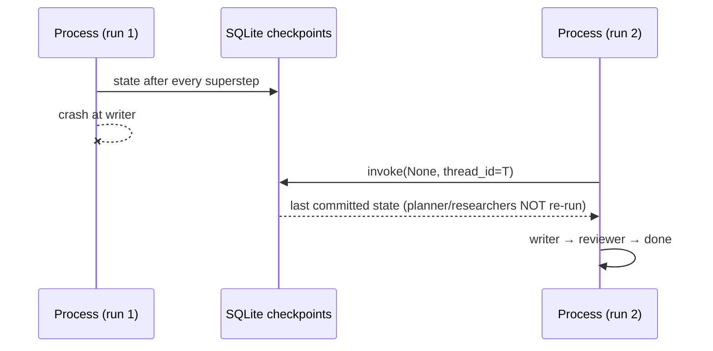

# Low-Level Design (LLD) — deep-research

> Companion to the [HLD](HLD.md): this document specifies component internals —
> module layout, node contracts, state, algorithms, API, storage, and error
> handling. File references are clickable paths into the codebase.

---

## 1. Module Map

```
src/deep_research/
├── config.py            Settings (pydantic-settings): models, caps, paths; ""-keys → None
├── net.py               setup_tls(): OS trust store (corporate TLS interception)
├── cli.py               argparse entry: run/resume/--auto-approve/--show-trace
├── schemas/             Pydantic contracts for every LLM boundary (see §4)
├── llm/
│   ├── tiering.py       structured_llm()/text_llm(): budget→fallbacks→rate limit
│   └── content.py       extract_text(): normalize provider content formats
├── graph/
│   ├── state.py         ResearchState (TypedDict) + ResearcherInput
│   ├── builder.py       wiring + ALL routing functions (control flow in one file)
│   └── nodes/           14 nodes, one file each, pure state→partial-state
├── tools/
│   ├── registry.py      ToolSpec table + catalog(); _guarded choke point
│   ├── tavily_search.py / wikipedia.py / scraper.py / semantic_search.py
├── guardrails/          pii · injection · url_policy · budget · rate_limit
├── memory/              vector_store (Chroma wrapper) · episodic · semantic ·
│                        embeddings · checkpointing (SqliteSaver)
├── observability/       tracing (TraceRecorder/format_trace) · cost · feedback
├── prompts/             *.md prompt registry + load_prompt() (cached)
└── api/                 manager.py (sessions/threads) · app.py (routes)
```

## 2. Graph Specification

### 2.1 Node contracts

| Node | LLM tier | Reads | Writes | Notes |
|---|---|---|---|---|
| `input_guard` | none | topic | topic (scrubbed), refusal?, input_notes | length/injection/PII rules |
| `router` | cheap | topic | route | RouteDecision structured output |
| `simple_answer` | cheap | topic | sources, report | 1 search + 1 cited answer |
| `memory_recall` | none | topic | prior_context | best-effort episodic lookup |
| `planner` | cheap | topic, route, prior_context | sub_topics | 1–3 SubTopics (schema-enforced) |
| `hitl` | none | sub_topics | sub_topics (edited) or refusal | `interrupt()`; resume decision |
| `researcher` ×N | cheap | ResearcherInput payload | research_results (append) | bounded ReAct, §6.2 |
| `quality_gate` | none | research_results | needs_replan | deterministic scoring, §6.1 |
| `replanner` | cheap | needs_replan, topic | revised_sub_topics | titles preserved (join key) |
| `analyst` | strong | research_results, topic | sources (deduped), claims | drops invalid citation ids |
| `synthesizer` | strong | claims, topic | synthesis | conflicts explicitly listed |
| `writer` | strong | synthesis, sources, review? | report, revision_count | revision mode when review present |
| `reviewer` | cheap | report, topic, sources | review | rubric-scored 0–10 |
| `memory_store` | none | topic, report, synthesis, sources | — | episodic+semantic write-back, best-effort |

### 2.2 Routing functions (all in `graph/builder.py`)

| Function | Condition → target |
|---|---|
| `route_after_input_guard` | refusal → END, else router |
| `route_after_router` | `simple_lookup` → simple_answer; else memory_recall (fail-open to the thorough path) |
| `fan_out_after_hitl` | refusal(cancel) → END; else one `Send("researcher", {sub_topic, attempt:1})` per sub-topic |
| `route_after_gate` | needs_replan non-empty → replanner, else analyst |
| `fan_out_replanned` | one `Send(..., attempt:2)` per revised sub-topic |
| `route_after_review` | score ≥ pass (7) or revisions ≥ max (2) → memory_store; else writer |

## 3. State Schema (`graph/state.py`)

```python
class ResearchState(TypedDict, total=False):
    topic: str
    refusal: str                  # set ⇒ run ends, message mirrored into report
    input_notes: list[str]        # e.g. PII kinds scrubbed
    route: Route                  # simple_lookup | deep_research | comparison
    prior_context: str            # episodic recall block
    sub_topics: list[SubTopic]
    research_results: Annotated[list[ResearchResult], operator.add]  # ← reducer:
                                  # parallel branches append; concat, never overwrite
    needs_replan: list[SubTopic]
    revised_sub_topics: list[SubTopic]
    sources: list[Source]         # deduped, numbered by analyst
    claims: list[Claim]
    synthesis: SynthesisOutput
    report: str
    review: ReviewVerdict
    revision_count: int

class ResearcherInput(TypedDict):  # private Send() payload per researcher
    sub_topic: SubTopic
    attempt: int
```

## 4. Data Contracts (`schemas/`)

| Model | Fields (constraints) |
|---|---|
| `SubTopic` | title (≥3), search_query (≥3), rationale (≥3) |
| `PlannerOutput` | sub_topics: 1–3 SubTopics |
| `Source` | url (≥10), title (default "(untitled)"), snippet, score? |
| `ResearchResult` | sub_topic, sources, attempt (≥1), history: list[str] (ReAct trail) |
| `ReactStep` | reasoning (≥5), **action: Literal[tavily_search, wikipedia, fetch_url, semantic_search, finish]**, action_input |
| `Claim` | statement (≥10), confidence: high/medium/low, source_ids (≥1, validated in code) |
| `SynthesisOutput` | summary (≥50), key_findings (≥1), conflicts[] |
| `ReviewVerdict` | score 0–10, issues[] |
| `RouteDecision` | route, reason (≥5) |

The `Literal` action means the model *cannot* name a nonexistent tool — the SDK
rejects and retries at the schema layer.

## 5. Sequence Diagrams

### 5.1 Deep run with HITL (API driver)



### 5.2 Crash resume



## 6. Key Algorithms

### 6.1 Quality-gate score (`nodes/quality_gate.py`) — deterministic
```
score(result) = 0.50 · mean(domain_trust(url))        # curated table; unknown = 0.6; .gov/.edu = 1.0
              + 0.25 · fraction(snippet ≥ 200 chars)
              + 0.25 · min(source_count / 3, 1)
flag for replan iff score < threshold(0.4) AND attempt == 1
                 AND title has no attempt-2 sibling      # ← termination invariant
```

### 6.2 Bounded ReAct loop (`nodes/researcher.py`)
```
run_tool(tavily, planned_query)                  # step 0: seeded, no LLM call
for i in range(MAX_REACT_ITERATIONS):            # default 5, hard cap
    step = structured_llm(ReactStep).invoke(goal + catalog + history + budget line)
    if step.action == finish: break
    run_tool(step.action, step.action_input)     # errors → history "ERROR:", never raise
sources deduped by URL; history = audit trail
```

### 6.3 Circuit breaker (`tools/scraper.py`) — per-domain state machine
`closed → (3 consecutive failures) → open → (300 s cooldown) → half-open probe →
success ⇒ closed / failure ⇒ open`. SSRF policy check precedes any fetch.

### 6.4 Model access composition (`llm/tiering.py`)
`RunnableLambda(check_budget) | primary.with_structured_output(S).with_fallbacks([fb…])`
— budget raises **before** any provider; each model internally retries w/ backoff
and shares one process-wide token bucket (`requests_per_minute / 60`).

## 7. API Specification (`api/app.py`)

| Method & path | Request | Response / codes |
|---|---|---|
| POST `/research` | `{topic: 1..2000}` | `{thread_id, status}` |
| GET `/research/{id}` | — | `{status, plan?, result?, error?}`; 404 unknown |
| POST `/research/{id}/approve` | `{decision: approve\|edit\|cancel, sub_topics?}` | 200; **409** not awaiting; **422** edit w/o sub_topics |
| GET `/research/{id}/stream` | — | SSE `data:` events (`node_completed`, `awaiting_approval`, terminal), ends `[DONE]` |
| GET `/research/{id}/trace` | — | `{trace: "<span timeline>"}` |
| POST `/feedback` | `{thread_id, rating: up\|down, comment?}` | `{status: recorded}`; 404 unknown thread |

Session state machine (in `api/manager.py`):
`running → awaiting_approval → running → done | cancelled | error` (409 on
approve outside `awaiting_approval`).

## 8. Storage Schemas (all under `data/`, gitignored)

| Store | Format | Key / record shape |
|---|---|---|
| Checkpoints | SQLite (`langgraph-checkpoint-sqlite` schema) | thread_id → serialized graph state per superstep |
| Episodic memory | Chroma collection `episodic` | id=thread_id; text=topic+findings; meta{topic, findings, date, report_head} |
| Semantic memory | Chroma collection `semantic` | id=sha256(url)[:24] (upsert ⇒ update, not dupe); meta{url, title, snippet} |
| Traces | `traces/<thread_id>.jsonl` | header `{type:trace,…}` then `{type:span, name, kind:node\|llm, offset_ms, duration_ms, tokens?, cost_usd?}`; feedback records appended |
| Feedback | `feedback.jsonl` | `{thread_id, rating, comment, timestamp}` |

## 9. Error-Handling Matrix

| Failure | Layer | Behavior |
|---|---|---|
| Malicious/short/oversized topic | input_guard | Explained refusal, $0, END |
| LLM 429/5xx transient | model client | Retry w/ backoff (≤2) |
| LLM persistent failure / model retired | tiering | Fallback chain (cross-family); error only if all fail |
| Budget cap reached | budget gate | `BudgetExceededError` pre-call → CLI prints partial-results + resume cmd |
| Tool call fails | researcher | Becomes an ERROR observation; agent adapts |
| Domain repeatedly failing | scraper breaker | Instant-fail 300 s, then probe |
| Disallowed URL | policy/SSRF | Filtered from results / fetch refused |
| Process crash | checkpointer | Resume same thread; completed steps not re-run |
| Memory/tracing failure | memory_*, recorder | Swallowed (best-effort); run never fails |
| Bad HITL edit | API 422 / Pydantic | Rejected before touching the graph |

## 10. Configuration Reference (env / `.env`)

`GOOGLE_API_KEY`, `TAVILY_API_KEY` (required for live runs; empty ⇒ absent) ·
`CHEAP_MODEL`/`STRONG_MODEL` + `CHEAP_FALLBACKS`/`STRONG_FALLBACKS` ·
`MAX_SESSION_BUDGET_USD` (1.0) · `MAX_REACT_ITERATIONS` (5) ·
`MAX_WRITER_REVISIONS` (2) · `REQUESTS_PER_MINUTE` (12) ·
`GATE_QUALITY_THRESHOLD` (0.4) · `REVIEWER_PASS_SCORE` (7) ·
`EMBEDDING_MODEL` · `MEMORY_PATH` · `CHECKPOINT_PATH` · `TRACES_PATH` ·
`FEEDBACK_PATH` · `BLOCKED_DOMAINS` · `LANGFUSE_*` (optional) ·
`EVAL_SAMPLE_SIZE` (2). Full semantics: [config.py](../src/deep_research/config.py).

## 11. Test Architecture

Seams: nodes import `structured_llm`/`text_llm`/`get_tool` by name ⇒ monkeypatch
per module; `tests/unit/fakes.py::wire_deep_pipeline()` fakes the whole pipeline
with **query recording** so tests assert consequences (e.g. "the edited query ran").
Memory/observability tests isolate via env-path overrides + settings cache clear.
Suite layers: 132 offline unit tests (CI) · live integration (self-skip w/o keys) ·
eval suite (marker `evals`; deterministic citation gate + LLM judge; secrets-gated
CI job).
